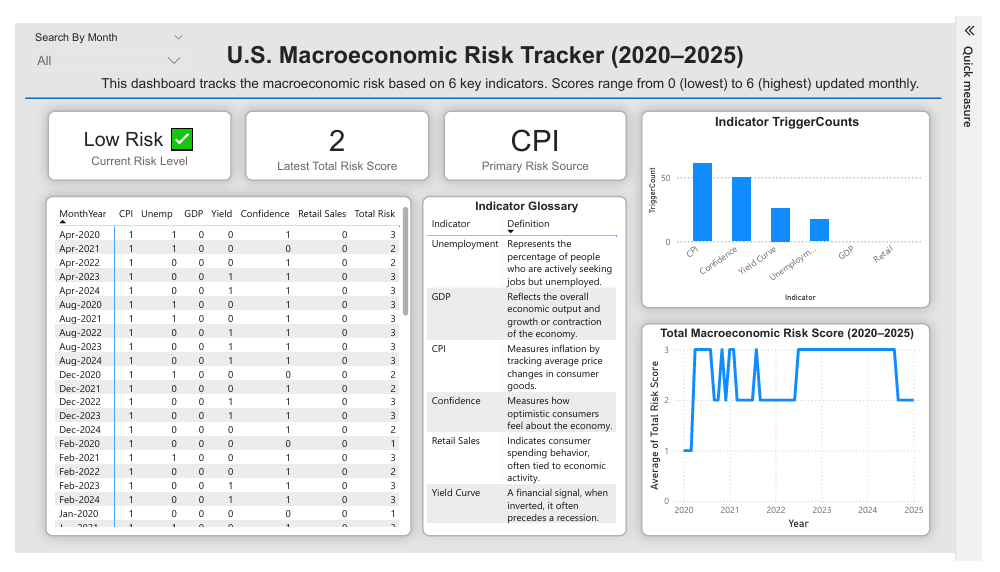

# macroeconomic-risk-dashboard
A Power BI dashboard tracking U.S. macroeconomic risk using CPI, GDP, and other indicators (2020–2025).
# 📊 U.S. Macroeconomic Risk Tracker (2020–2025)

This Power BI dashboard tracks macroeconomic risk in the United States using 6 key indicators:
- Consumer Price Index (CPI)
- Unemployment Rate
- GDP
- Yield Curve Inversion
- Consumer Confidence
- Retail Sales

## 🔍 Key Features
- Dynamic risk scoring (0–6 scale)
- Primary risk source identification
- Monthly data breakdown with custom tooltips
- Indicator glossary and historical trends

## 📁 Files
- `Macroeconomic_Risk_Tracker.pbix` – Full Power BI file
- `Macroeconomic_Risk_Master_Table.xlsx` — Original Excel file used to build the dashboard
- `Dashboard_Screenshot.png` – Visual preview
- `Dashboard_Export.pdf` – Static PDF version 
- `measures.dax` – All custom logic used to calculate risk scores, trigger contributions, dynamic tooltips, and explanatory text for the macroeconomic indicators.

## 📸 Preview

## 🛠️ Built With
- Power BI Desktop (April 2025)
